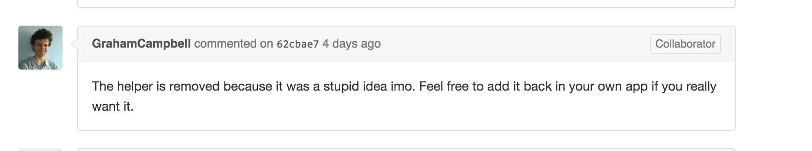

[We are not stupid!](https://github.com/laravel/framework/commit/62cbae78ba2d40944892c5a16f2d2463087bce23#commitcomment-15116529)
================




#Laravel missed helpers in version 5.2

### Installation
```
  composer require morilog/laravel-helpers
```

### Available helpers

#### Router
- `get()`
- `post()`
- `delete()`
- `put()`
- `patch()`
- `resource()`
- `group()`
- `route_group()` alias of `group()`
